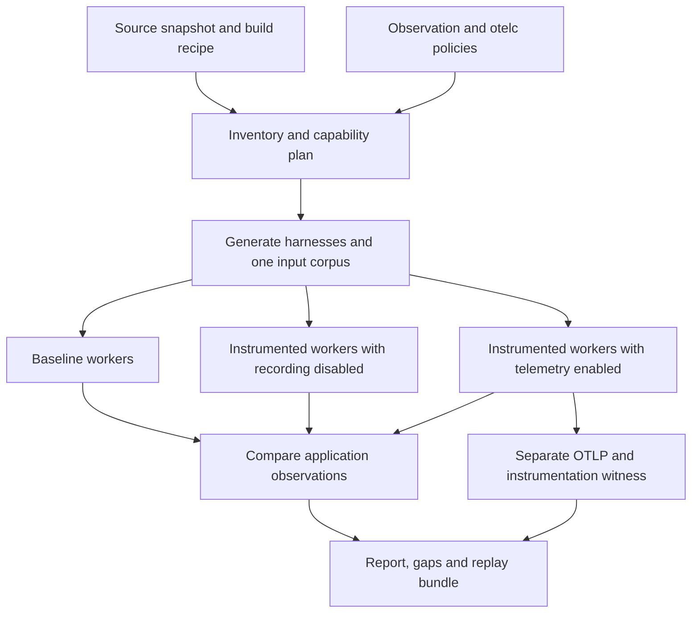

# System design

## Aim and status

oteleq generates repeatable tests and compares an application's behaviour with and without otelc instrumentation. Its claim is **equivalence over these tests and observations**, bounded by the recorded inputs, build identities, execution environment and observation coverage.

This is the broader application design as of 8 October 2026. The initial [Rust workload comparator](workload-comparison.md) is implemented and CI checks its product coverage. The proposed executor, semantic discovery, test generation, typed graph comparator and language adapters are not implemented.

## Requirements

| Requirement | Design response |
| --- | --- |
| Work across every current otelc language | Adapters for C, C++, Rust, Python, Java, JavaScript, TypeScript and Go use one protocol and comparison model |
| Generate tests across a source tree | Inventory every discovered callable and generate runnable cases where types and fixtures permit; retain explicit reasons for every gap |
| Leave original source unchanged | Read the target tree; put tests, tooling dependencies, generated helpers and build copies in a private external workspace |
| Allow an independent test framework | Each adapter supplies its own runner and dependency environment without changing the target's test setup |
| Allow users to keep the tests | Retain the workspace or explicitly promote generated tests, fixtures and dependency instructions into a chosen repository directory |
| Compare global and instance mutations | Compare declared globals, receiver state and input-reachable object graphs before and after identical action sequences |
| Account for telemetry | Identify telemetry through its dedicated transport/runtime identities; compare application observations independently |
| Produce reviewable evidence | Retain corpus, fixtures, artefact hashes, instrumentation witness, normalisation rules, gaps and reproducible differences |

## Core implementation choice

Use Rust for the orchestrator, versioned data contracts, input-corpus coordinator, comparator and reporting. This aligns with otelc and allows a distributable CLI with bounded resource management and strong types for incomplete or invalid evidence. The project name is `oteleq`; the proposed executable is `quux-oteleq`.

Language adapters own semantic discovery, harness generation and observation. They use the target language's established compiler/runtime tooling where necessary and communicate through subprocesses. There is no requirement to implement a Python AST analyser or Java class inspector entirely in Rust. Target code never executes inside the orchestrator's process, so a target crash cannot corrupt the comparison service.

Use typed ASTs, semantic compiler data and declared build context rather than regular expressions to recognise functions. Prefer official toolchain APIs. A syntax parser can produce an inventory candidate but cannot certify types, build inclusion, visibility or safe invocation alone.

Initial core boundaries are `cli`, `plan`, `workspace`, `corpus`, `executor`, `compare`, `report` and `otelc-provider`. Keep these as modules until a real packaging boundary warrants separate crates. Each language adapter implements the same versioned subprocess contract.

## Execution flow

1. Snapshot the selected application tree and record content hashes, dependency locks, build recipe, toolchains and instrumentation policy. Include dirty/untracked selected source; a Git revision alone does not identify it.
2. Discover callables using each project's actual build conditions, target architecture and type context. Emit the entire inventory, including excluded functions and uninstantiated templates/generics.
3. Generate harnesses, fixtures and a concrete input corpus in a private workspace. Resolve unresolved factories and dependencies as named blockers.
4. Prepare separate baseline and instrumented workers with identical application inputs, initial state and build settings except the declared instrumentation delta.
5. Run control repeats and paired cases, recording state at declared boundaries and effects through declared channels. Run a bounded action sequence as one case when stateful behaviour matters.
6. Verify that the selected application code is actually instrumented. Keep telemetry and exporter health outside application output comparison.
7. Compare observations, shrink reproducible differences and produce a replay bundle. Preserve all attempts and gaps.
8. Hash original source, manifests and lockfiles again. Any target-tree write is a failed preservation check, even if functional comparisons match.

## Comparison lanes

| Lane | Execution | Purpose |
| --- | --- | --- |
| `baseline` | Application without otelc transformation, probes or linked instrumentation runtime | Establish application observations |
| `instrumented-off` | Instrumented code and runtime present; supported metrics/traces recording disabled | Exercise transformed control flow and off-state behaviour |
| `instrumented-on` | Instrumented code with selected metrics/traces active and a bounded local OTLP receiver | Exercise probes, SDK/runtime, exporter and shutdown |
| `instrumented-fault` | Optional bounded slow/rejecting/unavailable receiver and queue-pressure scenarios | Check application behaviour when telemetry delivery fails |

The primary comparisons are baseline versus each required instrumented lane. Off/on comparisons are supplementary. The baseline is always genuinely uninstrumented; an instrumented build with a disabled exporter cannot serve as the baseline.

Recording disabled, exporting disabled and exporting to a local receiver are different execution paths. The otelc provider must report which modes actually exist for each pinned adapter/backend. A no-op exporter is optional and must be identified precisely; a local receiver still exercises serialisation and network calls. Missing control capabilities cause a visible unavailable lane, never a silent substitute.

The default planned functional check requires baseline and telemetry-on execution. Policy lists required and optional lanes separately. A missing required lane makes the run incomplete; an unavailable optional lane remains a visible coverage gap. Live off/on transitions are separate stateful sequences with their own observation and telemetry expectations.

## Relationship to otelc

Keep oteleq as a separate repository and executable. Invoke a pinned otelc build/launch provider using its documented wrapper commands and resolved schema-2 policy. Record the executable hash, version/revision, adapter/backend, selected functions and fully resolved non-secret policy. Never invent a supported control operation or infer support from the source language alone.

The provider obtains a capability plan using otelc's configuration resolution, support checking, `doctor` and inspected selection. It must also confirm installed toolchain compatibility and actual execution. Static configuration acceptance is insufficient.

Generated harnesses, test runners, observation helpers and their dependencies are excluded from otelc selection. Record the mapping from original function IDs to otelc's selected function identities. A tested but uninstrumented function is reported as such.

An instrumentation witness combines inspected build/selection evidence with expected telemetry for a deterministic calibration and the test workload. The design must support all eight languages; the witness implementation must accommodate their different metric names and manifests. Aggregate counters cannot always certify every individual case, so state that granularity. A function with no supported witness cannot obtain an instrumented equivalence verdict.

## Harness and shipping evidence

Generated unit tests commonly need a test executable, synthetic caller or package-private access helper. Such runs produce `unit_harness` evidence tied to those exact artefacts. Adding tests can change compiler flags, optimisation, linkage, module initialisation or `cfg(test)` behaviour. The report exposes these changes.

A separate `production_workload` lane runs the actual baseline and instrumented release artefacts using recorded inputs, CLI/API scenarios or integration workloads. Its artefact hashes must be the hashes of the files intended for deployment. Managed applications also record loaded bytecode/module transforms and agent/loader identities; an unchanged JAR or script hash alone does not identify its executed instrumented form.

Only this second evidence class may describe a comparison of the shipping artefacts. Unit harness success cannot be promoted into that claim. If observation requires extra diagnostic probes or altered access rules, label the result `diagnostic` and do not represent the modified build as the shipping artefact.

For actual release outputs, retain build provenance and the reproducible command recipe. Source preservation proves the source files were preserved; it does not prove the produced executable is equivalent.

## Isolation and repeatability

Each lane receives an independent reconstruction of the same fixture specification and concrete inputs. Run the same sequence in separate processes with separate writable directories, ports and external fixture instances. Do not call both variants sequentially in one application process or share mutable fixture objects between them.

Run at least two baseline control executions before a comparison can be labelled stable. Repeat the instrumented execution as well. Seed, environment, locale, timezone and fixture clocks are recorded; time/randomness injection is used only at supported fixture boundaries and is an explicit observation qualification. Unexpected nondeterminism produces `inconclusive`, not a pass after retries.

Preserve logical source/module paths, relative assets and build identity through qualified compiler path maps or overlays where supported. Workspace paths and launcher environment differences are declared execution deltas. If application-visible path/environment behaviour changes, record it as a difference or an explicitly qualified observation rule; do not silently scrub it from output.

Use independent process launches initially. A reused worker is allowed only after the adapter proves its complete reset contract, including static state, imports, caches and fixture effects. A sequence intentionally preserves state only within that case.

Concurrency checks use bounded scenarios, declared invariants and observation of external effects. Thread scheduling and timings can change under instrumentation; equality in a sampled schedule is not a proof for all interleavings. Compare partial ordering only when the relevant effect channels define it. Performance budgets are reported separately from functional equivalence.

Arbitrary repositories contain build scripts and executable code. Run them in an explicit local/container/CI environment, put outputs in the workspace and keep production credentials absent. Native execution and container isolation have distinct qualification; macOS and Linux capabilities are listed separately.

## Result model

Every selected inventory entry has separate generation, execution, observation and instrumentation status, plus a derived verdict.

| Verdict | Meaning |
| --- | --- |
| `equivalent_observed` | Stable paired cases match within the recorded observation scope, all required lanes complete and instrumentation is witnessed |
| `different_observed` | A reproducible difference exists in a declared application observation |
| `inconclusive` | Nondeterminism, timeout, observation truncation, unverified instrumentation or comparable evidence is missing |
| `blocked` | A fixture, build recipe, accessible callable or requested capability is unavailable |
| `excluded` | An explicit policy excludes the function; it remains in inventory |

Baseline crashes, undefined behaviour and invalid generated inputs are retained with a `target_invalid` reason and prevent equivalence for those cases. Harness/protocol/build failures use `tool_error`. These are not successful target comparisons, even when both variants fail alike.

A completed report can contain tested matches and gaps. The run summary says, for example, "equivalence over 150 paired cases and the recorded observations for 12 functions; 3 functions blocked". It never says all 15 functions passed. Default strict CI fails on selected blockers or incomplete requested observations. A less strict user policy must retain the gaps prominently.

The run's denominator includes all selected discovered functions and build variants. Count executable cases, exercised callables and observation dimensions separately from source line/branch coverage. Zero executed cases cannot yield a successful run.

## Evidence bundle

The report contains source tree and dependency hashes, artefact class and hashes, toolchains/flags, otelc build and policy identity, generator/runner versions, concrete corpus, seeds, fixtures, selected/excluded function inventory, captured dimensions, state roots and gaps, telemetry witness and loss/transport evidence, exact differences, replay commands and source-preservation checks.

Retain raw attempts beside canonical comparisons. Exclusions and normalisation rules are explicit, narrow, hashed and shown with before/after values where safe. A user cannot remove a difference by silently widening an ignore rule.

Captured values may contain application data. Workspaces use private permissions and bounded retention. Redaction is applied before durable storage where configured; redacted fields are recorded as unobserved and cannot count towards equality. Generated code and any optional AI-assisted proposal stay local unless the user chooses an external service.
